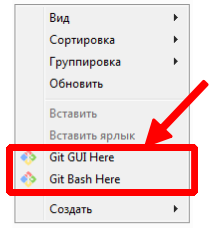
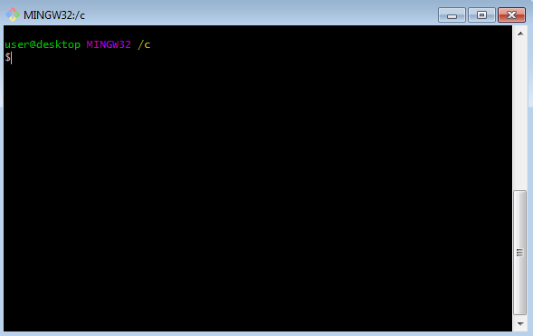

# **NeuroStartUp**
NeuroStartUp - динамически развивающийся стартап, специализирующийся на поиске с использованием новейших технологий искусственного интеллекта. Наши преимущества:

* Высокая точность поиска
* Высокая скорость поиска
* Низкая цена

## **Начало работы**
Чтобы получить копию данного проекта для запуска на локальном ПК необходимо склонировать репозитарий с *веб-сервиса GitHub*. Для этого в *распределенной системе управления версиями Git* используем операцию "git clone", вот последовательность шагов для исполнения:
1. Создаем папку на локальном ПК, в которой будет храниться проект;
1. Открываем в данной папке Git Bash;
1. Копируем URL, по которому располагается
удаленный репозиторий;
1. В командной строке Git Bash выполняем команду: git clone и URL проекта. Например, "git clone https://github.com/OlgaNorina/Demonstration.git"

### **Prerequisites**
Для работы с проектом на локальном ПК необходимо установить:
* Распределенная система управления версиями **Git**, которую можно скачать по [ссылке](https://git-scm.com/download/win);
   
* Также для работы с проектом может потребоваться редактор исходного кода, например **Visual Studio Code**, [ссылка для скачивания](https://code.visualstudio.com)

### **Установка и запуск Git**
1. Запустите скачанный на предыдущем шаге exe-файл. Дождитесь появления экрана установки.
1. Далее следуйте инструкции, которая находится по [ссылке](https://github.com/netology-code/guides/blob/master/git/REAMDE.md)
1. Чтобы проверить правильность установки кликните правой кнопкой мыши на любой папке в Windows, в открывшемся контекстном меню должны появиться две новых опции (как показано на скриншоте):

Выберите опцию Git Bash Here. Вы должны увидеть окошко, похожее на то, что показано на скриншоте:

где user - имя вашего пользователя, desktop - имя вашего компьютера.

## **Лицензия**
При установке Git на первом экране вам предложат согласиться с условиями лицензии GNU GPL. Внимательно их прочитайте, после чего нажмите кнопку Next 